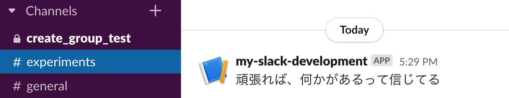

# diy-slack-post
Slackに投稿するコードの共通化

## Usage

assumes Python >= 3.7 (development in Python 3.8)

```shell
$ git clone https://github.com/ftnext/diy-slack-post
$ cd diy-slack-post
$ export SLACK_BOT_USER_TOKEN="Bot User OAuth Access Token"  # from OAuth & Permissions page
$ python main.py experiments 頑張れば、何かがあるって信じてる
```


